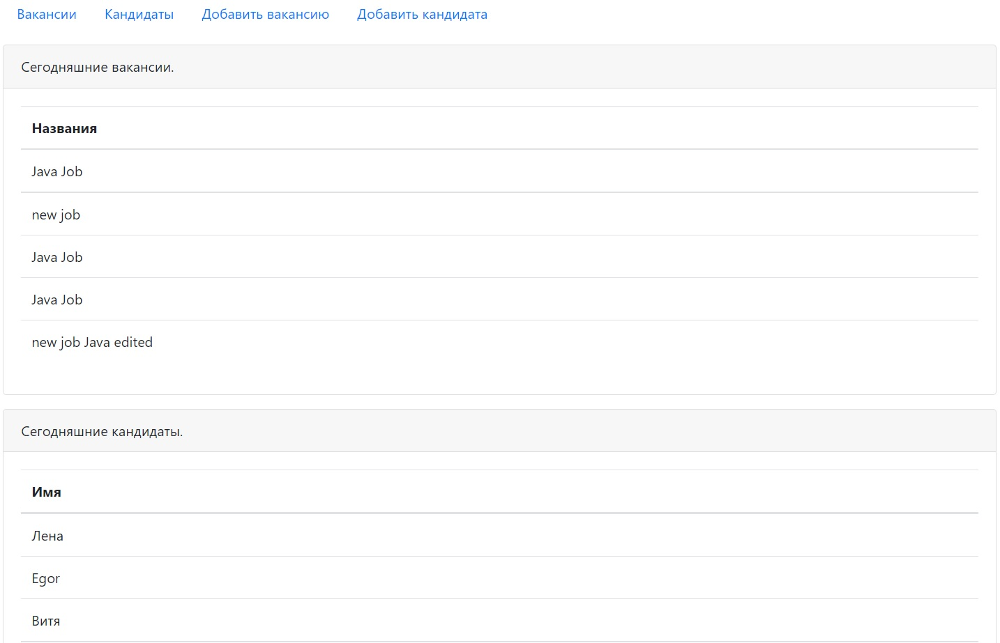
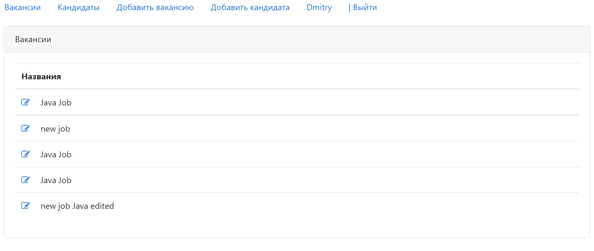
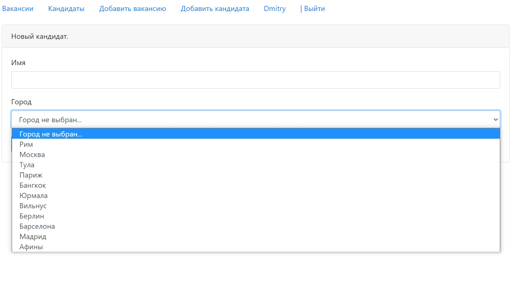

# job4j_dreamjob

**О проекте:**

Проект для изучения Java EE.
Данное приложение - биржа работы.
В системе два типа пользователей: кандидаты и рекрутеры. Кандидаты могут публиковать резюме. Рекрутеры могут публиковать вакансии о работе.
Кандидаты могут откликнуться на вакансию. Менеджер может пригласить на вакансию кандидата.

### Используемые технологии
* Java 12
* Java EE Servlets, JSP, JSTL
* PostgreSQL, JDBC
* JUnit, Mockito, PowerMock
* Maven, Tomcat
* HTML, JavaScript, jQuery, JSON

**Использование:**

